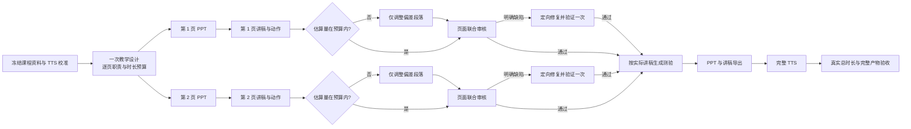

# 课程质量对比实验室

这是运行在 `3010` 端口的独立实验工具。它只读写 `.openpbl-runtime/course-quality-lab/`，不会创建正式课程、修改正式数据库或切换正式生成入口。

## v4 流程

v4 保留 PPT、讲稿、测验和 TTS 的分步产物，把返工原因移到首次生成前解决。三门冻结课程各生成 1 次独立新版本，共 3 组；每组都与归档的上一份完整优化版逐页对比。模型、音色、自然语速、页数、题量、学习目标和整节时长不变。



每批教学设计都在一次调用中生成共享合同。合同给每页分配：新增知识、必要推理、资料逐字依据、PPT 必显关系、讲稿展开内容、理解检验，以及按当前 TTS 音色校准出的自然语速预算。学生 PPT 或讲稿中出现的无依据、来源不足或真伪存疑断言不阻断生成，也不触发自动改写；系统保存完整课程，并将疑点写入 `teacherReviewNotes`，在课程生成后提醒教师逐条复核和修改。提醒本身只对教师可见。

PPT 页面并行生成，讲稿在对应页面 PPT 完成后生成。最终联合审核一次覆盖事实依据、知识覆盖、案例推理、画面与讲稿一致性、自然表达、相邻页重复和师生信息隔离。确定性代码继续检查 JSON、引用 ID、布局、越界和动作合法性。没有缺陷的两页课程结构上为 8 次逻辑调用：设计 1、PPT 2、讲稿 2、联合审核 2、测验 1；这是流程结果，不是调用上限。

## 根因与修改对应

| 已确认根因 | v4 修改 | 验证信号 |
| --- | --- | --- |
| 教学设计没有时长预算，六页事后统一压缩 | 设计阶段注入当前 TTS 校准；讲稿首次按每页预算写作，仅偏差页局部调整 | `narration-budget-adjust` 不再成为常规调用；真实整节时长仍须在 ±10% |
| PPT 与讲稿职责不一致 | `requiredVisibleContent` 与 `narrationFocus` 成为生成和审核的同一合同 | 联合审核不要求 PPT 和讲稿重复相同文字，关键条件和证据仍在画面可见 |
| 提示多层重复，当前页设计多次出现 | 当前页完整合同只提供一次，其他页只给递进摘要；测验只追加实际讲稿 | `calls.json` 中首次 PPT、讲稿输入字符下降 |
| 页面、讲稿、压缩后审核重复 | 合并为一次页面联合审核；只有真实缺陷才定向修复并验证 | 首次通过率上升，审核调用从常规多轮降为每页一次 |
| 检查点过晚导致整页重做 | 原始模型响应、解析后 PPT、讲稿、修复、审核、测验、音频均即时保存 | 故障注入后只恢复未完成阶段，`checkpointReuses` 增加 |
| 实验外层与底层重复重试 | 实验层只记录；模型传输重试、流式活动和超时只由底层客户端处理 | 分开报告逻辑调用、真实请求、传输重试、中断和质量修复 |
| 审核问题无法稳定绑定目标 | 问题统一为类别、目标类型、目标 ID、逐字证据和修复要求；缺失内容引用合同 requirement ID | 虚构 ID 或证据在进入修复前被拒绝 |

## 检查点与停止条件

运行目录按实验、课程、批次和方案隔离。切换到 v4 前，旧清单先存入 `manifest-history/`，旧产物和 `reviews.json` 原样保留。`calls.json` 保存逻辑调用及真实传输尝试，`model-responses/` 保存成功返回的原始文本，`partial.json` 保存解析后的逐页阶段，`telemetry.json` 保存恢复与修复统计，`tts-calls.json` 保存音频生成和缓存情况。每个阶段使用规则版本、输入和依赖产物指纹；修改一段讲稿只会使对应审核、测验依赖和音频失效。

模型返回后即保存原文。进程在解析前中断时会复用该响应；解析格式无效时只将该阶段标为无效并重新请求该阶段，不重做 PPT 或讲稿。修复后若知识覆盖、案例推理、图文对应、自然表达、师生信息泄漏或跨页重复等阻断问题重复、没有进展或出现回归，生成器保存诊断并停止自动返工，不放行这些缺陷。事实依据疑点转为教师复核提醒，不进入自动返工。刷新失败时，清单继续展示上一份完整结果。

## 生成与恢复

```bash
pnpm quality-lab:generate
```

默认用两路任务并发执行 3 组新版本，页面本身也保持并行。单实例锁防止多个进程写同一实验。可生成或恢复单组：

```bash
pnpm quality-lab:generate -- --section generative-ai-verification --batch 1
```

只补跑缺失或失败的真实音频：

```bash
pnpm quality-lab:generate -- --section generative-ai-verification --batch 1 --tts-only --retry-failed
```

音频缓存键包含完整讲稿、服务商、模型、音色、语速、语言、格式和地址配置。讲稿或配置变化后不会错误复用旧音频。最终验收使用完整真实音频，不变速、不截断，也不把缺失音频计入达标时长。

## 运行指标与实验报告

3010 页面区分逻辑调用、真实请求、传输重试、质量修复、中断、检查点复用、TTS 调用、排队和端到端时间。供应商返回 Token usage 时使用原值；否则按项目统一的每 2.5 字符估算并标“约”。历史归档没有真实请求或 v4 遥测时明确显示“未记录”，不以零冒充可比数据。

三次生成完成后，报告写入 `.openpbl-runtime/course-quality-lab/reports/source-first-workflow-v4.md`，包含三门课程各一次运行及三次总体的中位数与范围、首次通过率、修复率、真实时长、音频缓存情况和逐页人工评判入口。评测调用与生成调用分开统计。

## 迁移边界

可迁移的生成核心以四类边界工作：编排器只决定阶段依赖；模型网关负责一次逻辑调用并回报真实传输尝试；检查点存储按指纹保存原始响应和解析产物；进度事件向 UI 或任务系统报告阶段状态。实验文件系统只是检查点适配器。正式系统迁移时可替换为数据库或对象存储，并沿用相同的阶段键、问题对象、依赖失效和停止条件，不需要复制 3010 的页面或文件路径。

正式迁移前还需通过多小节长课程与并发负载验证。本轮不会切换正式生成入口。

## 启动与验证

```bash
pnpm quality-lab:build
pnpm quality-lab:start
```

打开 <http://127.0.0.1:3010>。评判自动保存到 `reviews.json`，页面支持导出 JSON、CSV、PPTX、讲稿和音频包。

```bash
pnpm quality-lab:typecheck
pnpm quality-lab:test
pnpm exec eslint tools/course-quality-lab --max-warnings 0
```
